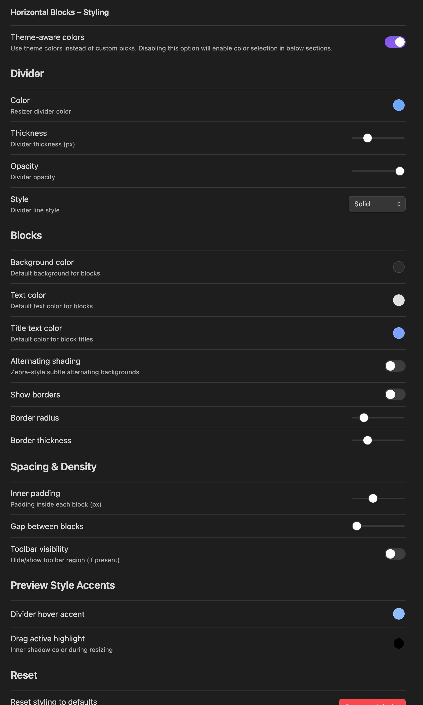

README.md

# 🧱 Horizontal Blocks Plugin

Bring Notion-style layouts with blocks side-by-side, resizable markdown blocks that support full Obsidian syntax including images, embeds, and internal links.

---

## ✨ Features

- 🔲 **Side-by-side markdown blocks** using `horizontal` code block
- 📏 **Resizable columns** with a draggable divider
- 🧠 **Dynamic layout** — support for 2 or more columns using `---` separator
- 🖼️ **Auto-scaling images** inside blocks
- 💾 **Block width persistence** — remembers layout when you return

```
⚠️ WARNING
Please refrain from entering tasks directly within the Horizontal code block. 

The Horizontal function operates based on the code block. In Obsidian, text within a code block is treated as plain text. Consequently, if you input tasks inside a code block, neither the tasks plugin nor the dataview plugin will be able to recognize them.
```

---

## 🔔 What's New

- New trigger alias `hblock` for the horizontal layout code block.
- Live editing for page/section embeds within blocks, with reduced extra spacing for a cleaner look.
- Styling settings tab: tweak divider (color, thickness, opacity, style), block backgrounds/borders, padding and gaps, toolbar visibility, and theme-aware colors — all applied live via CSS variables.
  - Also includes text color option for block content.
  - Title text color for block headers.
- Per-block toolbar inside each column: width +/- controls, and per-block background/text color pickers with instant updates and persistence.
  - Right-click any block for quick visibility toggles (toolbar, borders, alternating shading).

---

## 🚀 Examples

### Code 1:

<pre>
```horizontal  
### Block 1  
This is the left block.  
---
### Block 2  
This is the right block.  
```
</pre>

### Preview 1:


---

### Code 2:
<pre>
```horizontal  
### Left Block  
This is the left block.  
---
### Middle Block  
This is the middle block.
---
### Right Block  
This is the right block.  
```
</pre>

### Preview 2:


---
### Code 3:
 <pre>
```hblock
### Left Block
This is free text
- Item 1
- [ ] Item 2
- **Item 3**

This is a ***formatted*** **text**
---
### Right Image Block
![[test_image.png]]
```
</pre>

### Preview 3:


---

## 🎨 Styling Settings

You can customize the layout appearance globally without editing CSS:

- Divider: color, thickness (1–5px), opacity, and style (solid | dashed | dotted | transparent); hover accent and drag highlight.
- Blocks: background color, optional alternating shading (zebra), show/hide borders, border radius, border thickness.
  - Text color for content inside blocks.
  - Title text color for block headers.
- Spacing: inner padding (0–32px) and gap between blocks (0–24px).
- Toolbar: global visibility toggle for optional `.hblocks-toolbar` areas.
- Theme-aware: auto-inherit theme colors instead of custom picks.

Find it under Obsidian → Settings → Community Plugins → Horizontal Blocks – Styling.

All options apply via CSS variables/classes, so themes/snippets can override them; changes apply live without restart.

<!-- ### Screenshots

- Styling panel overview:
  
  

- Live resizing and hover accents:
  
   -->

### Toolbar Controls

- Width +/-: Nudge the current block’s width by small steps; changes are saved.
- Background: Per-block background color picker (overrides global background).
- Text color: Per-block foreground color picker (overrides global text color).

---

## 🧾 Changelog

See the full release history in [CHANGELOG.md](CHANGELOG.md).

---

## 🛠️ Feature Requests & Bug Reports

Please submit all bug reports and feature requests [via our GitHub Project](https://github.com/users/iCodeAlchemy/projects/6/views/4) to help us track and prioritize efficiently.

🙌 Your feedback directly shapes the future of this plugin!

---

## 👏🏼 Support

Have you found the **Horizontal Blocks** plugin helpful, and want to support it? I welcome donations to support future development efforts. However, I typically do not accept payments for bug bounties or feature requests, as financial incentives can create stress and expectations that I prefer to avoid in my hobby project!

Support @iCodeAlchemy:

<a href="https://www.buymeacoffee.com/iCodeAlchemy" target="_blank"></a>


