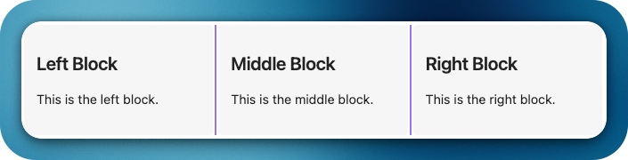

# 🧱 Horizontal Blocks Plugin

Bring Notion-style layouts with blocks side-by-side, resizable markdown blocks that support full Obsidian syntax including images, embeds, and internal links.

---

## ✨ Features

- 🔲 **Side-by-side markdown blocks** using `horizontal` code block
- 📏 **Resizable columns** with a draggable divider
- 🧠 **Dynamic layout** — support for 2 or more columns using `---` separator
- 🖼️ **Auto-scaling images** inside blocks
- 💾 **Block width persistence** — remembers layout when you return

> [!WARNING]
> Please refrain from entering **tasks** directly within the Horizontal code block. 
>
> The Horizontal function operates based on the code block. In Obsidian, text within a code block is treated as plain text. Consequently, if you input tasks inside a code block, neither the tasks plugin nor the dataview plugin will be able to recognize them.

---

## 🚀 Examples

### Code 1:

<pre>
```horizontal  
### Block 1  
This is the left block.  
---
### Block 2  
This is the right block.  
```
</pre>

### Preview 1:


---

### Code 2:
<pre>
```horizontal  
### Left Block  
This is the left block.  
---
### Middle Block  
This is the middle block.
---
### Right Block  
This is the right block.  
```
</pre>

### Preview 2:


---
### Code 3:
 <pre>
```horizontal
### Left Block
This is free text
- Item 1
- [ ] Item 2
- **Item 3**

This is a ***formatted*** **text**
---
### Right Image Block
![[test_image.png]]
```
</pre>

### Preview 3:


---

## 🐞 Contributing

Contributions via bug reports, bug fixes, documentation, and general improvements are always welcome. For more major
feature work, make an issue about the feature idea / reach out to me so we can judge feasibility and how best to
implement it.

---

## 👏🏼 Support

Have you found the **Horizontal Blocks** plugin helpful, and want to support it? I welcome donations to support future development efforts. However, I typically do not accept payments for bug bounties or feature requests, as financial incentives can create stress and expectations that I prefer to avoid in my hobby project!

Support @iCodeAlchemy:

<a href="https://www.buymeacoffee.com/iCodeAlchemy" target="_blank"></a>
